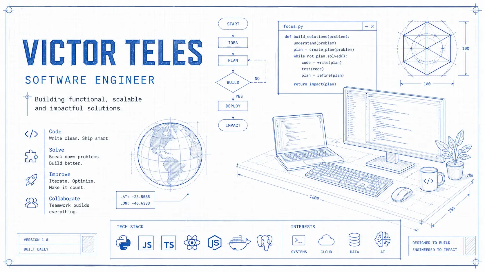

<picture>
	<source media="(prefers-color-scheme: dark)" srcset=".github/banner-dark.webp" />
	
</picture>

---

Team leader & open-source enthusiast based in Brazil. I build developer tools, automation, and products around modern web stacks.

## What I’m focused on

- AI-assisted developer tooling (Copilot, MCPs, “developer experience” automation)
- Web automation and testing
- Fast systems (Rust) and pragmatic backends

## Featured projects

| Project | What it is | Stack |
| --- | --- | --- |
| [copilot-claude-proxy](https://github.com/victor-teles/copilot-claude-proxy) | Make GitHub Copilot compatible with Anthropic API | TypeScript |
| [playwright-php](https://github.com/victor-teles/playwright-php) | A Playwright bridge for PHP | PHP |
| [mcpbr](https://github.com/victor-teles/mcpbr) | Directory of MCPs for Brazilian APIs/services | TypeScript |
| [pix.js](https://github.com/victor-teles/pix.js) | Packages for working with Pix and Dict API | TypeScript |
| [AspNetCore.Pulse](https://github.com/victor-teles/AspNetCore.Pulse) | ASP.NET Core HealthChecks packages | C# |
| [victormesquita.dev](https://github.com/victor-teles/victormesquita.dev) | My personal tech blog | TypeScript |

## Tech I use

## Notes & experiments

I also keep a lot of explorations, forks, and spikes around:

- Solana tooling (Rust/TypeScript)
- UI kits and design systems (Next.js/TypeScript)
- DevOps/self-hosting experiments

## Stats

## Get in touch

- Blog: https://victormesquita.dev
- X: https://x.com/engineerdesoft

